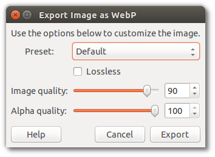

## gimp-webp

This plugin provides [Gimp](https://www.gimp.org/) with the ability to load and export [WebP](https://developers.google.com/speed/webp/) images. During export, a dialog is presented that provides access to image quality settings.

The plugin is designed to run on all platforms currently supported by the Gimp.

### Building

In order to build this plugin, you will need the following app, tools, and libraries installed:

 - CMake 2.8.12+
 - Gimp 2.8 or 2.9 development files
 - Webp 0.4+ development files

The build process consists of:

    mkdir build
    cd build
    cmake ..
    make

### Installation

On most *nix platforms, installation is as simple as:

    sudo make install

If you don't have root privileges, you can copy the `src/file-webp` binary to the appropriate directory:

- **Gimp 2.8.x:** &mdash; `~/.gimp-2.8/plug-ins/`
- **Gimp 2.9.x:** &mdash; `~/.config/GIMP/2.9/plug-ins/`
